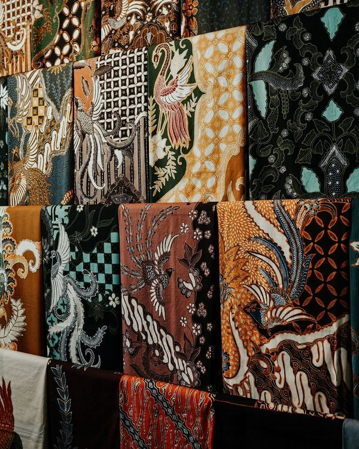

# Rencana Website: Jogja Digital Heritage

Tema lomba: **Nusantara Digital City — Yogyakarta**. Frontend-only, TailwindCSS, TanStack Start, desain Editorial Heritage (anti-AI generik), bilingual ID/EN, peta interaktif Leaflet.

## 1. Arah Desain (Editorial Heritage)

Target rasa: majalah National Geographic Indonesia × museum keraton modern. Jauh dari template AI.

- **Palet warna** (earthy heritage Jogja):
  - `--bg-cream` #F5EFE4 (latar utama)
  - `--ink` #1A1714 (teks, near-black hangat)
  - `--terracotta` #B5532A (aksen utama, genteng & batu bata)
  - `--keraton-gold` #C9A14A (aksen sekunder, ornamen)
  - `--deep-green` #2F4A3A (alam, sawah, pohon beringin)
  - `--paper` #FAF6EE (kartu)
- **Tipografi**:
  - Display: **Cormorant Garamond** (serif elegan editorial) — bukan Playfair (terlalu pasaran)
  - Body: **DM Sans** (sans modern, readable)
  - Aksen kecil/eyebrow: **JetBrains Mono** uppercase tracking-wide untuk label "01 — SEJARAH"
- **Komposisi**: grid asimetris ala majalah, garis tipis pembatas, drop cap di artikel, generous whitespace, foto besar dengan caption italic, angka section bertipografi besar.
- **Sudut**: tajam (radius 0–4px), bukan rounded-2xl.
- **Motion**: terkontrol — fade-up saat scroll, parallax halus di hero, hover image scale 1.03, tidak ada animasi norak di setiap elemen.

## 2. Struktur Halaman (9 route + bilingual)

```text
src/routes/
  __root.tsx              navbar + footer + LanguageProvider
  index.tsx               /                  Hero + intro 5 pilar + featured
  sejarah.tsx             /sejarah           Timeline Mataram → Kesultanan → Modern
  budaya.tsx              /budaya            Batik, Gamelan, Wayang, Tari, Upacara
  kuliner.tsx             /kuliner           Gudeg, Bakpia, Sate Klathak, dll
  wisata.tsx              /wisata            Grid destinasi
  wisata.$slug.tsx        /wisata/borobudur  Detail per destinasi (SEO-friendly)
  peta.tsx                /peta              Leaflet interaktif fullscreen
  teknologi.tsx           /teknologi         Jogja Smart City, startup, kampus
  kontak.tsx              /kontak            Form (frontend-only, mailto) + info
```

Setiap route punya `head()` dengan title + description + og unik.

## 3. Komponen Utama

```text
src/components/
  layout/Navbar.tsx          logo + nav + toggle ID/EN + mobile drawer
  layout/Footer.tsx          3 kolom + credit lomba
  ui/SectionLabel.tsx        "01 — SEJARAH" eyebrow mono
  ui/SectionTitle.tsx        H2 serif besar + garis pembatas
  ui/Eyebrow.tsx
  home/Hero.tsx              foto Tugu/Malioboro + headline serif besar
  home/PillarsGrid.tsx       5 pilar (Sejarah/Budaya/Kuliner/Wisata/Teknologi)
  home/FeaturedDestination.tsx
  home/QuoteBlock.tsx        kutipan filosofi Jawa
  cultural/CultureCard.tsx
  food/FoodCard.tsx          foto + nama + asal + harga estimasi
  wisata/DestinationCard.tsx
  wisata/DetailHero.tsx
  wisata/InfoPanel.tsx       jam buka, tiket, lokasi, tips
  map/LeafletMap.tsx         dynamic import (SSR-safe)
  map/MapMarkerPopup.tsx
  contact/ContactForm.tsx    frontend validation, submit → mailto:
  i18n/LanguageToggle.tsx
  i18n/useT.ts               hook pakai context, dictionary di src/i18n/
```

## 4. Konten (Yogyakarta)

- **Sejarah**: Mataram Kuno → Mataram Islam → Perjanjian Giyanti 1755 → Kasultanan → Kemerdekaan (ibu kota RI 1946) → DIY.
- **Budaya**: Batik (Parang, Kawung), Gamelan, Wayang Kulit, Tari Bedhaya, Sekaten, Gerebeg.
- **Kuliner**: Gudeg, Bakpia Pathok, Sate Klathak, Mangut Lele, Wedang Ronde, Kopi Joss, Oseng Mercon.
- **Wisata** (≥8 destinasi dengan halaman detail): Candi Borobudur, Candi Prambanan, Keraton Yogyakarta, Taman Sari, Malioboro, Tugu Jogja, Pantai Parangtritis, Hutan Pinus Mangunan, Goa Jomblang.
- **Teknologi**: Jogja Smart City, kampus (UGM/UII/UNY), startup lokal, ekosistem digital.

## 5. Peta Interaktif

- Library: `leaflet` + `react-leaflet`, tile OpenStreetMap (gratis, tanpa API key).
- Dynamic import agar tidak crash SSR (`window is not defined`).
- Marker custom (ikon SVG keraton/candi/pantai/kuliner) + popup foto + nama + link ke `/wisata/$slug`.
- Filter kategori (Wisata / Kuliner / Budaya) di sidebar peta.

## 6. Bilingual ID/EN

- `src/i18n/id.ts` & `src/i18n/en.ts` — dictionary flat key.
- `LanguageProvider` simpan ke `localStorage`, default `id`.
- Toggle di navbar (ID | EN), animasi underline.

## 7. Strategi Menang Lomba

1. **Anti-AI look**: serif Cormorant + earthy palette + drop cap + nomor section besar = juri langsung lihat ini bukan template generik.
2. **Lebih kaya dari kompetitor**: 9 halaman + detail wisata + peta interaktif + bilingual (teman cuma single-page).
3. **Polish detail**: micro-typography (small caps, ligatures), garis pembatas tipis, caption italic, hover state halus.
4. **Responsif sungguhan**: mobile bukan sekedar stack — navbar drawer, hero portrait, peta touch-friendly.
5. **Performa**: lazy load gambar, dynamic import Leaflet, preload font display.
6. **SEO + meta lengkap**: tiap route punya og image (foto hero halaman) → preview WhatsApp/Twitter cantik saat presentasi.
7. **Storytelling**: tiap section dibuka dengan kutipan/filosofi Jawa (mis. "Memayu hayuning bawana").

## 8. Urutan Build (saat masuk build mode)

1. Setup font + design tokens di `src/styles.css` (palet, font, tokens shadow).
2. Buat `__root.tsx` (Navbar, Footer, LanguageProvider) + i18n dictionary.
3. Home (`index.tsx`) + komponen Hero, Pillars, Featured, Quote.
4. Halaman konten statis: Sejarah, Budaya, Kuliner, Teknologi, Kontak.
5. Wisata list + dynamic detail `wisata.$slug.tsx` (data di `src/data/wisata.ts`).
6. Install Leaflet + halaman Peta.
7. Generate semua image asset (hero, destinasi, kuliner) via imagegen — gaya foto editorial, warna konsisten.
8. QA: responsif (mobile/tablet/desktop), bilingual toggle, semua link, meta tags.

## 9. Detail Teknis

- Stack: TanStack Start v1 + React 19 + Tailwind v4 (config di `src/styles.css` `@theme`).
- Font: di-load via `<link>` di `__root.tsx` head (Google Fonts: Cormorant Garamond, DM Sans, JetBrains Mono).
- Form kontak: frontend-only, validasi react-hook-form + zod, submit jadi `mailto:` (sesuai arahan guru: tanpa backend).
- Tidak ada Lovable Cloud (tidak diperlukan).
- Image: generated via imagegen, disimpan di `src/assets/`, di-import ES6.

---

Kalau rencana ini oke, klik **Implement plan** dan saya mulai build dari setup design tokens + navbar dulu. Kalau ada yang mau ditambah/diubah (kota detail, palet, halaman ekstra seperti Galeri/Event), bilang sekarang ya kak.
